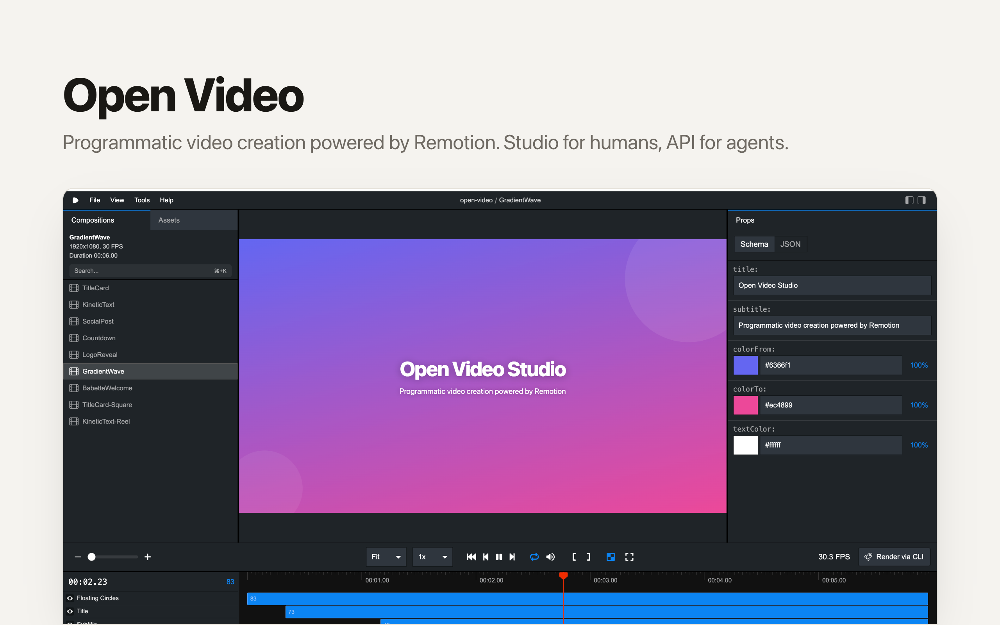

# OpenVideo

[](https://app.clawnify.com/deploy?repo=clawnify/OpenVideo)

An open-source, **agent-friendly video editor**. Upload your footage, trim and arrange the clips on a timeline, add text and music, and export to **MP4**.

A project is a plain-JSON **edit decision list**, not a proprietary project file: a person edits it on the timeline, and an AI agent can read and change the same document through the API.

## Why

Most editors keep a project in a format built for their own app, not for you or an agent to read. Here the main track is an ordered list of clips, times are seconds, and positions are fractions of the frame. That makes it easy for an agent to assemble a cut, and easy for a person to adjust what the agent did.

## Features

- **Timeline editor**: a main track of clips that play end to end, text on overlay tracks, music on audio tracks. Trim, split, reorder and zoom, with filmstrips and waveforms.
- **Live preview**: one master clock plays the cut back in the browser as you edit.
- **Media library**: upload clips, stills and music, or import them from Google Drive, and use them in any project. Long footage goes to the managed media service, so a multi-gigabyte master plays and exports without passing through the app.
- **Captions**: switch them on for the whole video, pick one of twelve languages and one style. The words come from each clip's transcript, so captions follow every trim, split and reorder.
- **Ask for a change**: describe an edit in your own words and it is applied to the cut you have. The model calls a fixed set of checked operations, so the edit is always a valid document. One instruction, one undo.
- **AI assist**: Auto-cut watches several clips together and assembles the strongest sequence for what the video is for, captions included; Clean up trims one clip down to its good parts.
- **Export to MP4** in draft, standard or high quality, on Clawnify's managed edit service.
- **Agent-ready**: a REST API (`/api/assets`, `/api/drive`, `/api/projects`, `/api/exports`) and an `agent.md`, so an AI agent can assemble, edit and export videos without a human in the loop. Validation errors carry a JSON pointer to the offending node, so an agent's edit loop self-corrects.

## How an edit works

A project is one JSON document. The main track is an ordered array, so splicing a clip in is an array insert and nothing else has to be recomputed:

```json
{
  "version": 1,
  "output": { "width": 1280, "height": 720, "fps": 30 },
  "main": { "elements": [
    { "id": "intro", "type": "video", "src": "asset:3f9c2a1b8d4e6f70", "trimStart": 2 },
    { "id": "demo",  "type": "video", "src": "asset:9a1d4c7e2b5f8036", "duration": 12 }
  ]},
  "overlays": [{ "id": "titles", "elements": [
    { "id": "hook", "type": "text", "text": "Three features. One minute.", "fontSize": 72,
      "startTime": 0.5, "duration": 3, "x": 0.5, "y": 0.12, "align": "center" }
  ]}]
}
```

Overlays can also carry images and video (a logo in the corner, picture-in-picture). `agent.md` has the full format.

## Quickstart

```bash
pnpm install
pnpm dev        # editor UI + API, with a local database & storage
```

Open the editor, hit **New project**, upload a clip from the **Media** panel, click it to put it on the timeline, and trim it. Export and the AI tools run on Clawnify's managed services, so they work once the app is deployed.

## Deploy

This is a [Clawnify](https://clawnify.com) app — deploy it to your org with the CLI:

```bash
npx clawnify deploy
```

Exporting runs on Clawnify's managed edit service, so deployed instances need no local video toolchain.

## Project layout

```
src/
  client/app.tsx     # app shell and router
  client/edit.tsx    # projects list and the editor: media rail, player, inspector, timeline
  client/ui.tsx      # shared control recipes (buttons, dialog, empty state)
  client/styles.css  # design tokens: palette, type scale, elevation
  server/            # REST API (assets, projects, exports) and EDL validation
agent.md             # how an AI agent assembles, edits and exports videos
```

## License

MIT.
