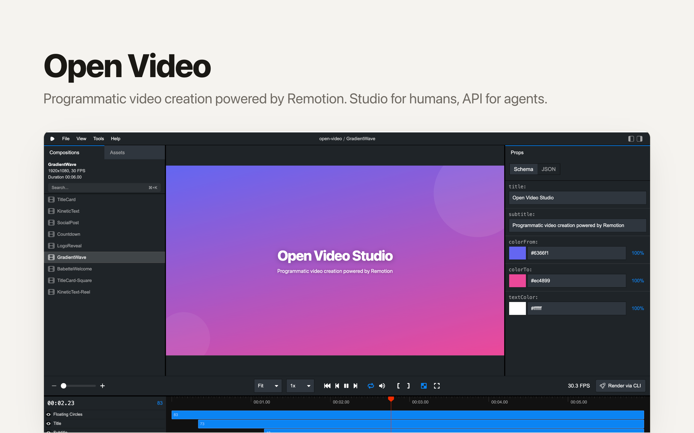

# OpenVideo

[](https://app.clawnify.com/deploy?repo=clawnify/OpenVideo)

An open-source, **agent-friendly video editor**. Upload your footage, trim and arrange the clips on a timeline, add text and music, and export to **MP4**.

A project is a plain-JSON **edit decision list**, not a proprietary project file: a person edits it on the timeline, and an AI agent can read and change the same document through the API.

## Why

Most editors keep a project in a format built for their own app, not for you or an agent to read. Here the main track is an ordered list of clips, times are seconds, and positions are fractions of the frame. That makes it easy for an agent to assemble a cut, and easy for a person to adjust what the agent did.

## Features

- **Timeline editor**: a main track of clips that play end to end, text on overlay tracks (colour, box and outline, for titles and captions alike), music on audio tracks. Trim, split, reorder and zoom, with filmstrips and waveforms.
- **Live preview**: one master clock plays the cut back in the browser as you edit.
- **Footage from a Drive folder**: start a project from a Google Drive folder shared with the link, and every video in it and in the folders inside it comes in as that project's own footage. Each clip is logged as it lands: what it shows, the best lines said with their times, the best moments to cut away to, and anything readable on screen. It runs in the background, so an agent can read a whole shoot's logs and choose what goes in.
- **Highlights**: every logged clip is read against what the video is for. You get the soundbites and the b-roll worth an editor's look, each scored with the reason why, and the clips not worth anyone's time set aside with theirs. Review them on one page where each pick plays from its in to its out, keep or drop with a key, and export what you keep as a timeline for Premiere Pro or DaVinci Resolve (the picks end to end on the camera files, nothing re-encoded) or as a sheet. Ask for a change uses them too: "make a 60 second cut from the kept soundbites".
- **Media library**: upload clips, stills and music, or import them from Google Drive, and use them in any project. Videos go straight to the managed media service, resumably and up to 30 GB, so a multi-gigabyte master plays, gets a transcript and exports without passing through the app. Each upload shows its progress, and one that drops picks up where it stopped.
- **Formats**: 16:9, 9:16 for Reels, TikTok and Shorts, 1:1, 4:5 and 4:3, or the shape of your own footage. Titles and logos keep their size and place when the shape changes, and clips either fit with bars or fill the frame.
- **Crop**: keep part of any clip, logo or picture-in-picture, free or held to 16:9, 9:16, 1:1, 4:5 or the video's own shape, with a scrubber to check the subject stays inside. The preview places a cropped clip exactly as the export does.
- **Fades**: fade a clip up from black and down to black, its sound with it, or make a fade through black between two clips. Titles, logos and music fade in and out the same way, and the preview plays each fade as it will export.
- **Transitions**: put a dissolve, a fade through black or white, a wipe, a slide, a blur or a pixelate on any cut, from the mark between two clips on the timeline, or on every cut at once. A transition is centred on its cut and moves no clip, so titles and music stay where you put them, and the preview draws each one frame for frame as it exports.
- **Captions**: switch them on for the whole video, pick one of twelve languages and one style. The words come from each clip's transcript, so captions follow every trim, split and reorder.
- **Ask for a change**: describe an edit in your own words and it is applied to the cut you have. The model calls a fixed set of checked operations, so the edit is always a valid document. One instruction, one undo.
- **AI assist**: Auto-cut watches several clips together and assembles the strongest sequence for what the video is for, captions included; Clean up trims one clip down to its good parts.
- **Export to MP4** in draft, standard or high quality, on Clawnify's managed edit service.
- **Share by link**: one link per project plays an export to anyone you send it to, with no sign-in, and a Download button. Pasted into a chat app, the link shows a frame of the video as its preview. The link stays on the export you shared until you move it to a newer one, so a draft never reaches viewers; turning it off ends it for everyone.
- **Agent-ready**: a REST API (`/api/assets`, `/api/drive`, `/api/projects`, `/api/projects/{id}/footage`, `/api/projects/{id}/highlights`, `/api/exports`, `/api/projects/{id}/share`) and an `agent.md`, so an AI agent can assemble, edit and export videos without a human in the loop. Validation errors carry a JSON pointer to the offending node, so an agent's edit loop self-corrects.

## How an edit works

A project is one JSON document. The main track is an ordered array, so splicing a clip in is an array insert and nothing else has to be recomputed:

```json
{
  "version": 1,
  "output": { "width": 1280, "height": 720, "fps": 30 },
  "main": { "elements": [
    { "id": "intro", "type": "video", "src": "asset:3f9c2a1b8d4e6f70", "trimStart": 2 },
    { "id": "demo",  "type": "video", "src": "asset:9a1d4c7e2b5f8036", "duration": 12 }
  ]},
  "overlays": [{ "id": "titles", "elements": [
    { "id": "hook", "type": "text", "text": "Three features. One minute.", "fontSize": 72,
      "startTime": 0.5, "duration": 3, "x": 0.5, "y": 0.12, "align": "center" }
  ]}]
}
```

Overlays can also carry images and video (a logo in the corner, picture-in-picture). `agent.md` has the full format.

## Quickstart

```bash
pnpm install
pnpm dev        # editor UI + API, with a local database & storage
```

Open the editor, hit **New project**, upload a clip from the **Media** panel, click it to put it on the timeline, and trim it. Export and the AI tools run on Clawnify's managed services, so they work once the app is deployed.

## Deploy

This is a [Clawnify](https://clawnify.com) app — deploy it to your org with the CLI:

```bash
npx clawnify deploy
```

Exporting runs on Clawnify's managed edit service, so deployed instances need no local video toolchain.

## Project layout

```
src/
  client/app.tsx     # app shell and router
  client/edit.tsx    # projects list and the editor: media rail, player, inspector, timeline
  client/ui.tsx      # shared control recipes (buttons, dialog, empty state)
  client/styles.css  # design tokens: palette, type scale, elevation
  server/            # REST API (assets, projects, exports), EDL validation, the public share page
agent.md             # how an AI agent assembles, edits and exports videos
```

## License

MIT.
